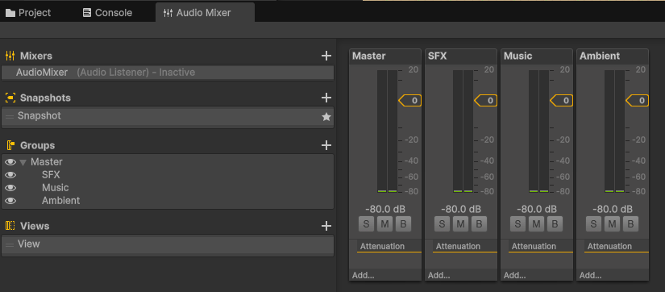

# Sonido en Unity
1. Configurar una escena simple en 3D con un objeto cubo que hará de player y varias esferas de color. Agregar un objeto AudioSource desde el menú GameObject → Audio 
Seleccionar un clip de audio en algún paquete de la Asset Store de tu gusto y adjuntarlo a una esfera. El audio se debe reproducir en cuanto se carga la escena y en bucle.

https://github.com/user-attachments/assets/12fd0820-cfe8-4840-abdf-edd1eab8cc94

2. En la escena anterior crea un objeto con una fuente de audio a la que le configures el efecto Doppler elevado y que se mueva a al pulsar la tecla m a una velocidad alta. Explica los efectos que produce:
- **Incrementar el valor del parámetro Spread:** Controla el ángulo de dispersión del sonido en los altavoces. Un ángulo de 0º es sonido mono, 180º es sonido estéreo y 360º hace que se reproduzca en el altavoz inverso al que le correspondería en sonido estéreo.
- **Cambiar la configuración de Min Distance y Max Distance:** Estos parámetros afectan a la recta que controla el volumen del sonido con respecto a la distancia al oyente. La distancia mínima (Min Distance) es aquella en la que se escuchará con volumen más alto, mientras que la distancia máxima (Max Distance) es aquella en la que el volumen será cero.
- **Cambiar la curva de Logarithmic Rolloff a Linear Rolloff:** Este parámetro cambia la función utilizada para la curva de volumen respecto a distancia. Esta curva pasa de tener una forma logarítmica a una forma lineal.

https://github.com/user-attachments/assets/ad70eef8-71d1-4f4e-b922-8439e1c9f23e

Script: [SphereMovement.cs](scripts/SphereMovement.cs)

3. Configurar un mezclador de sonidos, aplica a uno de los grupo un filtro de echo y el resto de filtros libre. Configura cada grupo y masteriza el efecto final de los sonidos que estás mezclando. Explica los cambios que has logrado con tu mezclador.

https://github.com/user-attachments/assets/03bb7630-862f-4508-85eb-0e5ba6242097

Con estos ajustes de mezclador se consigue que la música tenga un efecto de eco.

4. Implementar un script que al pulsar la tecla p accione el movimiento de una esfera en la escena y reproduzca un sonido en bucle hasta que se pulse la tecla s.

https://github.com/user-attachments/assets/1a0ae363-3159-4dc5-aea0-b03e8f7c821b

Script: [SphereStartStop.cs](scripts/SphereStartStop.cs)

5. Implementar un script en el que el cubo-player al colisionar con las esferas active un sonido.
6. Modificar el script anterior para que según la velocidad a la que se impacte, el cubo lance un sonido más fuerte o más débil.

https://github.com/user-attachments/assets/06f4d6d4-d3d0-42f6-b169-0317984321cc

Script: [CubePlayer.cs](scripts/CubePlayer.cs)

7. Agregar un sonido de fondo a la escena que se esté reproduciendo continuamente desde que esta se carga. Usar un mezclador para los sonidos.

Este ejercicio se ha realizado previamente en el ejercicio 1 y ejercicio 9.

8. Crear un script para simular el sonido que hace el cubo-player cuando está movimiento en contacto con el suelo (mecánica para reproducir sonidos de pasos).

https://github.com/user-attachments/assets/fbfe9bc0-69a3-40a1-9637-e8b8dcbfe232

Script: [FootstepSound.cs](scripts/FootstepSound.cs)

9. En la escena de tus ejercicios 2D incorpora efectos de sonido ajustados a los siguientes requisitos:
- Crea un grupo SFX en el AudioMixer para eventos:
    - Movimiento del personaje: Crea sonidos específicos para saltos y aterrizajes.
    - Interacción y recolección de objetos: Diseña sonido para la recolección de objetos.
    - Indicadores de salud/vida: Diseña un sonido breve y distintivo para cada cambio en el estado de salud (por ejemplo, ganar o perder vida).
- Crea un grupo Ambiente:
    - Crea un sonido de fondo acorde con el ambiente
    - Agrega una zona específica del juego en que el ambiente cambie de sonido
- Crea un grupo para música: 
    - Crea un loop de música de fondo acorde al tono del juego

https://github.com/user-attachments/assets/ebe46a0d-5324-4112-b8b1-875373e1f899

Scripts: 
- [BackgroundMusicTrigger.cs](scripts/BackgroundMusicTrigger.cs)
- [Collectible.cs](scripts/Collectible.cs)
- [PlayerController.cs](scripts/PlayerController.cs)
- [UIHealthBar.cs](scripts/UIHealthBar.cs)
